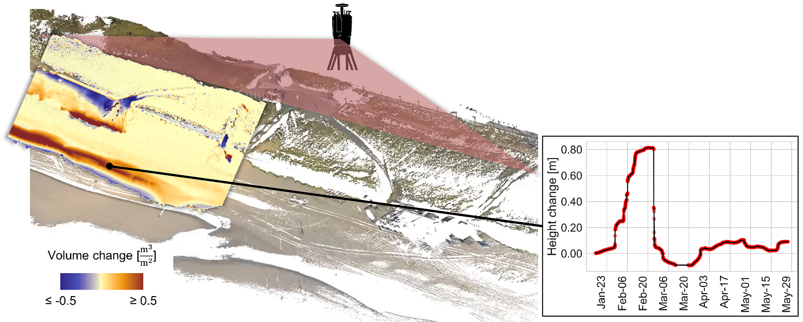

# 4D change analysis of near-continuous LiDAR time series for applications in geomorphic monitoring

A short course on 4D change analysis offered at the Virtual Geoscience Conference 2023 (https://vgc-series.org/) by [Katharina Anders](https://www.professoren.tum.de/anders-katharina), [Roderik Lindenbergh](https://www.tudelft.nl/citg/over-faculteit/afdelingen/geoscience-remote-sensing/staff/scientific-staff/dr-rc-roderik-lindenbergh), and [Mieke Kuschnerus](https://www.tudelft.nl/citg/over-faculteit/afdelingen/geoscience-remote-sensing/staff/phd-students/m-mieke-kuschnerus).

This short course introduces the acquisition and processing of 4D point clouds (theory), and presents methods to handle, explore, and visualize the data (hands-on) in a first part. The second part will feature time series-based methods of analyzing 4D point clouds (theory and hands-on), demonstrating how the temporal information in these data can be used to identify and assess occurrences and patterns of different surface activities in a scene. Notably, we introduce time series clustering and the extraction of 4D objects-by-change. The test dataset is a laser scanning time series of a sandy beach. Hands-on is performed with Python (basic skills required), where methods are available in the open-source library py4dgeo.



_The course is based on material of the [E-TRAINEE course](https://github.com/3dgeo-heidelberg/etrainee) by the [E-TRAINEE Development Team (2023)](#references). Find all details on the project in [Potůčková et al. (2023)](#references)._

# Prerequisites

Basic skills in programming and Python are required. 

Knowledge on principles of point cloud acquisition and processing are recommended. If required, suitable preparation material is provided by the E-TRAINEE course [here](https://3dgeo-heidelberg.github.io/etrainee/module3/01_pointcloud_principles/01_pointcloud_principles.html) ([E-TRAINEE Development Team (2023)](#references)).

# Software

## Python

The recommended practice to set up Python for this course, is to [create a Conda environment](https://docs.conda.io/projects/conda/en/4.6.0/_downloads/52a95608c49671267e40c689e0bc00ca/conda-cheatsheet.pdf) with all required modules (packages). Instructions for installation on various platforms are available in the [Anaconda documentation](https://docs.anaconda.com/anaconda/).

If you are using Conda, you may use the following procedure to create the Python environment `vgc2023` from the file vgc2023.yml in [course\assets\python_envs](https://github.com/tum-rsa/vgc2023-shortcourse-4d/tree/main/course/assets/python_envs):

```
conda env create -f vgc2023.yml
```

## CloudCompare

CloudCompare is an open-source 3D point cloud processing software. Download and install CloudCompare from the official website: http://www.cloudcompare.org/

We recommend to use the latest stable release.

Help for using CloudCompare can be found in the documentation: https://www.cloudcompare.org/doc/wiki/index.php/Main_Page


# Data

The course uses a time series of hourly point clouds acquired with permanent laser scanning (PLS) at a sandy beach by [Vos et al., 2022](#references). The full dataset is openly available on [this PANGAEA data repository](https://doi.org/10.1594/PANGAEA.934058) ([Vos et al., 2021](#references)).

An extract of this dataset to be used in this course is provided by E-TRAINEE (E-TRAINEE Development Team, 2023; _publication in progress_).

Download the dataset here: https://syncandshare.lrz.de/getlink/fiCv7tMhAy9keGGrncyMSQ/

Additionally, a time series of annual airborne laser scanning (ALS) data of the area is provided here: http://doris.tudelft.nl/~rlindenbergh/vgc/ (courtesy of the Dutch Public Works)

# References

E-TRAINEE Development Team (2023): E-TRAINEE - E-learning course on Time Series Analysis in Remote Sensing for Understanding Human-Environment Interactions (Version 0.2.0) [Computer software]. https://github.com/3dgeo-heidelberg/etrainee.

Potůčková, M., Albrechtová, J., Anders, K., Červená, L., Dvořák, J., Gryguc, K., Höfle, B., Lhotáková, Z., Marcinkowska-Ochtyra, A., Mayr, A., Neuwirthová, E., Ochtyra, A., Rutzinger, M., Šedová, A., Šrollerů, A., & Kupková, L. (2023): E-TRAINEE: Open e-learning course on time series analysis in remote sensing. ISPRS Archives of the Photogrammetry, Remote Sensing and Spatial Information Sciences (accepted). Proceedings of the ISPRS Geospatial Week 2023.

py4dgeo Development Core Team (2022): py4dgeo: library for change analysis in 4D point clouds [Source Code]. https://github.com/3dgeo-heidelberg/py4dgeo.

Vos, S., Anders, K., Kuschnerus, M., Lindenbergh, R., Höfle, B., Aarninkhof, S., de Vries, S. (2022): A high-resolution 4D terrestrial laser scan dataset of the Kijkduin beach-dune system, The Netherlands. Scientific Data, 9 (191). DOI: https://doi.org/10.1038/s41597-022-01291-9.

Vos, S., Anders, K., Kuschnerus, M., Lindenbergh, R., Höfle, B., Aarninkhof, S., de Vries, S. (2021): A six month high resolution 4D geospatial stationiary laser scan dataset of the Kijkduin beach dune system, The Netherlands. PANGAEA, DOI: https://doi.org/10.1594/PANGAEA.934058.

